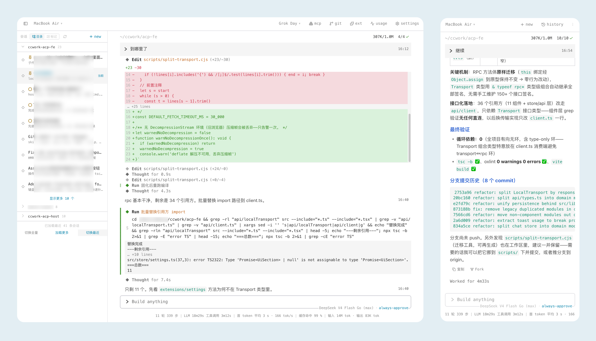

<p align="center">
  
</p>

<h1 align="center">Capri Host</h1>

<p align="center">
  <strong>连接你的 Grok Agent</strong><br />
  <em>Capricorn · AgentsHarness 的第一颗星座</em>
</p>

<p align="center">
  <a href="https://github.com/AgentsHarness/capri-host/releases"></a>
  <a href="https://github.com/AgentsHarness"></a>
  
  
</p>

---

[AgentsHarness](https://github.com/AgentsHarness) 让你随时随地远程使用 Agents。

**Capri**（Capricorn）是 [Grok Build](https://x.ai/cli) 的具体适配项目，我们基于 ACP 协议，搭配 capri-fe、capri-hub 实现远程 Agent 控制。

一个进程、一个端口，同时提供 **Web 界面** 和接口。Windows 上还内置**系统托盘**——

```
浏览器  ──本机──▶  capri-host :8765  ──▶  grok
浏览器  ──远程──▶  capri-hub        ──▶  capri-host × N  ──▶  grok
```

## 截图



## 快速开始

1、安装并登录 [`Grok Build`](https://x.ai/cli)（或设置 `XAI_API_KEY`）。

2、从 [Releases](https://github.com/AgentsHarness/capri-host/releases) 选你的平台。

**Windows**：首次运行 SmartScreen 可能拦一次，点「更多信息 → 仍要运行」。


**macOS / Linux**：

```bash
chmod +x capri-host   # 按实际文件名
# 参考环境变量进行自定义设置
./capri-host
```

**或者从源码构建：**

```bash
git clone https://github.com/AgentsHarness/capri-host.git
cd capri-host
go run ./cmd/capri-host
```

Windows 上要构建出「双击不弹黑框」的版本，必须带 `-H=windowsgui`——否则二进制
是 console 子系统，双击时 Windows 会给它开一个终端窗口：

```powershell
go build -ldflags "-s -w -H=windowsgui" -o capri-host.exe ./cmd/capri-host
```


## 系统托盘（Windows）

双击启动没有终端窗口，所以托盘是它唯一的可见入口：

| 菜单项           | 说明                                                                 |
| ---------------- | -------------------------------------------------------------------- |
| 打开本机地址     | `http://localhost:8765/`                                             |
| 打开内网地址     | `http://<局域网 IP>:8765/`，同一 Wi-Fi 下的手机 / 平板用这个         |
| 打开 hub 地址    | 仅在已配对时出现——未配对时那个地址打开是一个不认识你的页面           |
| 配对 hub…        | 先填 hub 地址，再填 6 位配对码。**新用户不需要手动创建任何配置文件** |
| 阻止电脑休眠     | 开关。只按住系统电源请求，屏幕仍然正常息屏                           |
| 连接信息…        | 本机名称、本机 / 内网 / hub 地址、配对与连接状态、配置与日志路径     |
| 开机自启         | 开关，**默认关闭**。写当前用户的注册表，不需要管理员权限             |
| 打开日志         | 打开 `logs\host.log`                                                 |
| 退出             | 同时结束 grok 子进程                                                 |

关于**配对**：填过一次之后 hub 地址会写回 `config.toml`，配对 token 写入
`hub.json`，之后重启直接连。配对失败（码错了、地址不通）不会影响当前已经建立
的连接。换到另一台 hub 也从这里操作，不需要重启进程。

关于**开机自启**：注册表里记的是 exe 的绝对路径。挪动 exe 之后再手动启动一次
会自动修正路径；但如果挪完直接重启，开机时会因为旧路径已经没有文件而什么都不
启动。登录启动时不会弹浏览器（命令行带 `--autostart` 标记）。

托盘只在 Windows 上编译。其他平台跑在 shell 或 service manager 里，托盘图标无处
安放，`Supported()` 直接返回 false。

## 配置文件

Windows 双击运行时没有人替你设置环境变量，所以设置放在
`%USERPROFILE%\.capri-host\config.toml`（**环境变量仍然优先于这个文件**）。

文件不会自动生成——不配也能跑，只是跑在纯本机模式。要连 hub，从托盘的
「配对 hub…」走一遍就够了，它会自己把文件写出来。手写的话：

```toml
# Windows 路径要用单引号（TOML 里 \ 在双引号中是转义符）
port     = 8765
grok_bin = 'C:\Users\you\.grok\bin\grok.exe'
host_id  = 'pc'
host_name = '家里的 Windows'
fe_token = 'xxxxxxxx'
hub_url  = 'https://hub.example.com'
```

| 键                          | 对应环境变量          |
| --------------------------- | --------------------- |
| `port`                      | `PORT`                |
| `grok_bin`                  | `GROK_BIN`            |
| `host_id` / `host_name`     | `HOST_ID` / `HOST_NAME` |
| `fe_token`                  | `FE_TOKEN`            |
| `hub_url` / `hub_pair_code` | `HUB_URL` / `HUB_PAIR_CODE` |
| `host_token`                | `HOST_TOKEN`          |
| `hub_quic_pin`              | `HUB_QUIC_PIN`        |
| `open_browser`              | `CAPRI_OPEN_BROWSER`  |
| `tray`                      | `CAPRI_TRAY`          |


### 文件位置

都在 `%USERPROFILE%\.capri-host\`（其他平台是 `~/.capri-host/`，可用
`CAPRI_HOST_DIR` 整体搬走）：

| 文件                 | 内容                                     |
| -------------------- | ---------------------------------------- |
| `config.toml`        | 设置                                     |
| `hub.json`           | 配对拿到的 token，配对成功后自动写       |
| `logs/host.log`      | 日志，超过 8 MiB 轮转                    |
| `last-session.json`  | 上次会话指针                             |

## 连接到 capri-hub

在一台能被访问的服务器上先起 [capri-hub](https://github.com/AgentsHarness/capri-hub)，
并部署 capri-fe。配对码由 **hub** 生成（6 位、15 分钟有效、过期自动轮换），host
只负责拿码去换 token：hub 侧 `capri-hub paircode` 或前端左上角「添加 Host」都能看到
当前有效的码。

**Windows：托盘 → 配对 hub…**，依次填 hub 地址和配对码，成功后地址自动写回
`config.toml`。

**其他平台**（或想用环境变量的话）：

```bash
# 自行修改
HUB_URL=http://<hub>:8787
HUB_PAIR_CODE=XXXXXX
HOST_ID=pc
HOST_NAME="家里的 Mac"
FE_TOKEN=XXXXXX
nohup ./capri-host >> capri-host.log 2>&1 & echo $! > capri-host.pid
```

配对成功后 token 写在 `~/.capri-host/hub.json`，之后只需带 `HUB_URL`、`FE_TOKEN` 重启。浏览器打开独立部署的前端地址，选这台 Host 即可。

同一台 hub 上 `HOST_ID` 必须唯一——hub 是按它建索引的，两台都用默认的 `local` 会
互相顶掉。从托盘配对时，如果本机标识还是默认值，会自动按机器名派生一个写进配置。

配对状态也有接口，前端和手机端用的是同一套：

| 接口                  | 说明                                                        |
| --------------------- | ----------------------------------------------------------- |
| `GET /api/hub/state`  | 是否配置 / 是否配对 / 是否连上 / 传输是 QUIC 还是 WS / 最近错误 |
| `POST /api/hub/pair`  | `{"code":"XXXXXX","hubUrl":"https://…"}`，`hubUrl` 可省略      |

更完整的部署说明（后台、开机自启、防火墙）见 [docs/DEPLOY.md](docs/DEPLOY.md)。事件语义契约（seq / 双路去重 / 分级背压）见 [docs/EVENT-CONTRACTS.md](docs/EVENT-CONTRACTS.md)。

## 常用变量

| 变量                  | 默认            | 说明                                                                                                                                 |
| --------------------- | --------------- | ------------------------------------------------------------------------------------------------------------------------------------ |
| `PORT`                | `8765`          | HTTP 端口（界面 + 接口）                                                                                                             |
| `BIND`                | `127.0.0.1`     | 监听地址。默认只听回环，只有本机能够直连；要让手机等同网段设备访问，显式设 `BIND=0.0.0.0`——那**必须**同时设 `FE_TOKEN`，否则拒绝启动 |
| `GROK_BIN`            | `grok`          | grok 可执行文件                                                                                                                      |
| `HOST_ID`             | `local`         | 多机时用来区分，同 hub 内需唯一                                                                                                      |
| `HOST_NAME`           | `Local Host`    | 界面上的名字                                                                                                                         |
| `XAI_API_KEY`         | —               | 可选；否则用 `grok login`                                                                                                            |
| `HUB_URL`             | —               | 设置后连上 Hub                                                                                                                       |
| `HUB_PAIR_CODE`       | —               | 配对码，也可从托盘输入                                                                                                               |
| `FE_TOKEN`            | —               | 本机接口的访问密钥（`/api/*`、`/events`）。与 Hub 的 `FE_TOKEN` **是两把独立的钥匙**，见下                                            |
| `HOST_TOKEN`          | —               | 直接给配对 token，跳过配对                                                                                                           |
| `CAPRI_HOST_DIR`      | `~/.capri-host` | 设置、日志、token 的存放目录                                                                                                         |
| `CAPRI_TRAY`          | `1`             | 设为 `0` 不启动托盘                                                                                                                  |
| `CAPRI_OPEN_BROWSER`  | `1`             | 设为 `0` 启动时不打开浏览器                                                                                                          |

## 两把 `FE_TOKEN`

Hub 和每台 Host 各有一把 `FE_TOKEN`，它们保护的对象不同，**不要求同值**：

- 经 Hub 中继的请求由 Host 进程自己注入凭据，浏览器只出示 Hub 那把；
- 浏览器直连本机端口（`127.0.0.1:8765`，省一跳延迟、Hub 挂了也还能用）时，出示的才是这台 Host 那把。

所以典型配法是：只在 Hub 上设 `FE_TOKEN`，Host 留空——回环 + 无密钥 = 近路是免鉴权的本机请求，
浏览器全程只问一次。给 Host 也设上一把同样可以：页面会先拿 Hub 那把探一次本机
（`GET /api/probe`），两把同值就不再多问，不同值才弹一次「这台 Host 的钥匙」。
Host 的密钥被拒只会让那一台退回 Hub 中继，不影响 Hub 登录。

## 项目生态

|                                 项目                        |          简介                       |
| ------------------------------------------------------- | ------------------------------- |
| [AgentsHarness](https://github.com/AgentsHarness)       | 总项目                          |
| [capri-hub](https://github.com/AgentsHarness/capri-hub) | 中继节点，转发用户和 Agent 消息 |
| [capri-fe](https://github.com/AgentsHarness/capri-fe)   | WebUI                           |

## 友情链接

[Linux.do](https://linux.do)

MIT
